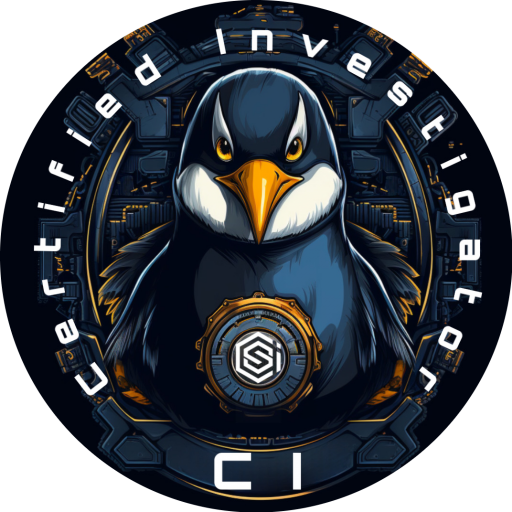

# Hello, I'm Hashim RAZAK

I am an active cyber security researcher with skills in testing networks and web applications for security vulnerabilities. With a bachelor's degree in Computer Application and an advanced certification in penetration testing.

## Objective

My journey in computer science has led me to develop a passion for cybersecurity. I am now eager to transition into this field, specifically to the offencive side. 

## Certifications

    
    
    

## Projects

